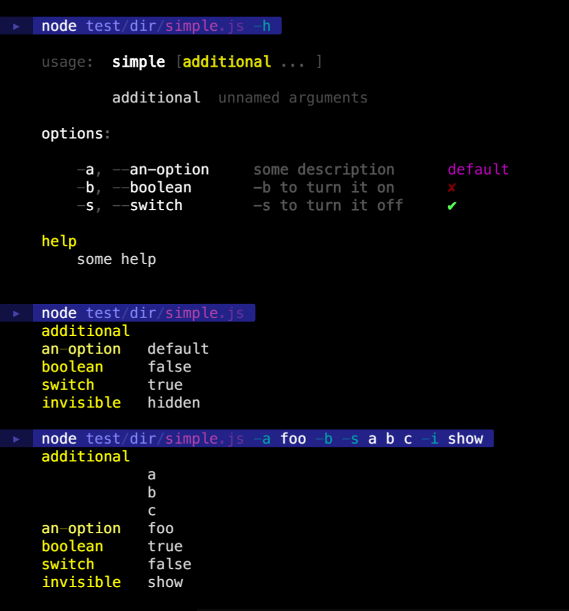

### karg

is the german word for **meager**, **barren**, **sparse**

### karg

is also an option parser with **meager features** but **simple setup** and **pretty output**

### meager features

does just the bare minimum:

- automatic help generation
- short and long option names
- unnamed arguments
- boolean toggle
- dictionary output

### simple setup

```coffee
args = require('karg') """

scriptname
    additional  . ? unnamed arguments . **
    an-option   . ? some description  . = default
    boolean     . ? -b to turn it on  . = false
    switch      . ? -s to turn it off . = true
    invisible                         . = hidden
    
help
    some help
    
version       1.0.0

"""
``` 

### pretty output




[![npm package][npm-image]][npm-url] 
[![Build Status][travis-image]][travis-url] 
[![downloads][downloads-image]][downloads-url] 
[![Dependencies Status][david-image]][david-url]

[npm-image]:https://img.shields.io/npm/v/karg.svg
[npm-url]:http://npmjs.org/package/karg
[travis-image]:https://travis-ci.org/monsterkodi/karg.svg?branch=master
[travis-url]:https://travis-ci.org/monsterkodi/karg
[david-image]:https://david-dm.org/monsterkodi/karg/status.svg
[david-url]:https://david-dm.org/monsterkodi/karg
[downloads-image]:https://img.shields.io/npm/dm/karg.svg
[downloads-url]:https://www.npmtrends.com/karg
